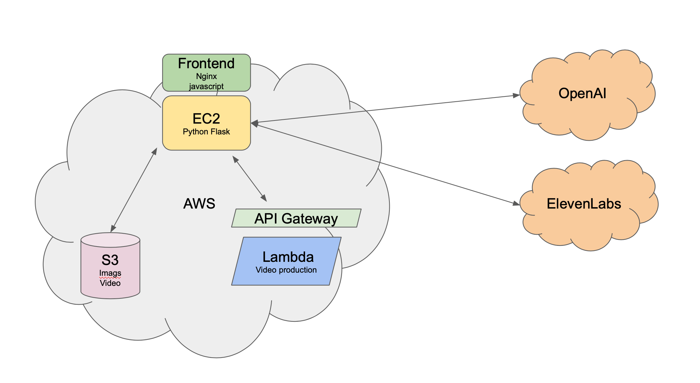

# The Sunfire Video App

The Sunfire Video App is an AI-powered tool that enables anyone to create vibrant and engaging promotional videos for products, events, or ideas with minimal input. Simply provide basic data about what you want to promote, along with a few images, and Sunfire Video App takes care of the rest, including script generation, audio narration, video production, and background music.

## Features

- Simple user interface
- Professional-quality results in less than 2 minutes
- AI-generated scripts and narration
- Automatic video production
- Background music selection

## Demo

[Click here to watch the video demo](https://www.strikerit.com/static/sunfire-demo.mp4)

[Screenshots of the application]

## Technologies Used

- Backend: Python with Flask
- Frontend: Vanilla JavaScript, HTML, and CSS
- Cloud Storage: AWS S3
- Serverless Computing: AWS Lambda
- AI Services: OpenAI, ElevenLabs



## Prerequisites

- Python 3.x (specific version to be determined)
- Web server (e.g., Nginx) capable of running Flask applications
- AWS account with S3 and Lambda access
- API keys for AWS S3, OpenAI, and ElevenLabs

## Installation

1. Clone the repository:
```bash
git clone https://github.com/yourusername/sunfire-video-app.git
cd sunfire-video-app 
```
2. Install Python dependencies:
```bash
pip install -r requirements.txt
```
3. Set up your web server to run Flask. This typically involves configuring your server (e.g., Nginx) to proxy requests to the Flask application running on a specific port.
```nginx
server {
    listen 80;
    server_name yourdomain.com;

    location / {
        proxy_pass http://127.0.0.1:8000;
        proxy_set_header Host $host;
        proxy_set_header X-Real-IP $remote_addr;
    }
}
```
4. Configure your environment variables with your API keys:
The tool expects these to either be in the environment or in a `.env` file in the same directory as the application.
5. (Optional) Install the music archive file for stored songs.

## Configuration

The `config` directory contains several configuration files that you may need to adjust:

- `config/sunfire-config.yaml`: Main application settings
- `config/music-data.yaml`: File describing the locally stored music library if applicable.
- `config/voice-data.tsv`: File describing available voices if needed.

Please review these files and adjust the settings as needed for your environment.

## Call Hierarchy Diagram

[Cick Here](https://docs.google.com/presentation/d/1Z9xU9yCZ8OVrkfkmGtSL03Z8XghXYA4QEjkP_4j5Lk4/edit?usp=sharing)

## Contributing

Contributions to The Sunfire Video App are welcome! Here are ways you can contribute:

1. Report bugs and suggest features by opening issues.
2. Submit pull requests with bug fixes or new features.
3. Improve documentation.
4. Share your experience and help others in the issues section.

Please read our [Contributing Guidelines](CONTRIBUTING.md) for more details.
### We Develop with Github
We use GitHub to host code, to track issues and feature requests, as well as accept pull requests.

### We Use [Github Flow](https://guides.github.com/introduction/flow/index.html)
Pull requests are the best way to propose changes to the codebase.

### Report bugs using Github's [issues](https://github.com/yourusername/sunfire-video-app/issues)
We use GitHub issues to track public bugs.

## License
By contributing, you agree that your contributions will be licensed under its Apache License 2.0.

## Code of Conduct
This project and everyone participating in it is governed by the [Sunfire Video App Code of Conduct](CODE_OF_CONDUCT.md). By participating, you are expected to uphold this code.
## Future Plans

Future releases of The Sunfire Video App will be community-driven. The core team will be focusing on a proprietary version with advanced features.

## License

The Sunfire Video App is licensed under the Apache License, Version 2.0. See the [LICENSE](LICENSE) file for the full license text.

For additional information:
- [NOTICE](NOTICE) file for copyright notices and third-party acknowledgments.
- [CONTRIBUTING.md](CONTRIBUTING.md) for guidelines on how to contribute to this project.
- [CODE_OF_CONDUCT.md](CODE_OF_CONDUCT.md) for our community standards.

Please note that this project may use third-party components with different licenses. See the [NOTICE](NOTICE) file for details.
## Contact

[Your contact information or preferred method of contact]